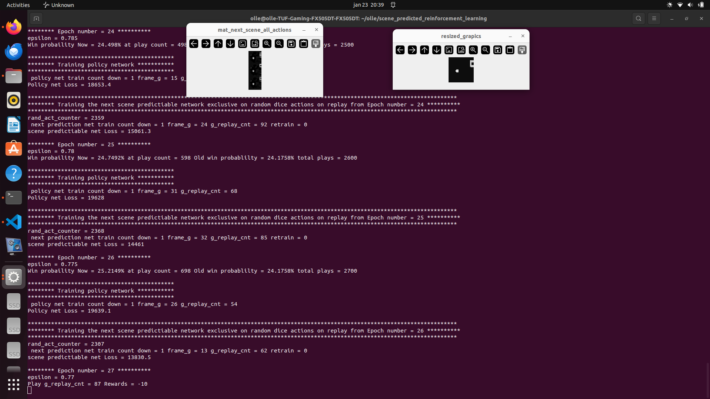

# Scene predicted reinforcement learning

Dual reainforcemnt learning network.
1. This first network try to predict the next frame scene one step in future. This network will one special scene for each possible action to next future state.
2. The other network is the take post frame f1,f2, present fram f3 and the next predicted frame to policy network control how the pad to the action.

Next scene network is purely trained on random action to not learn any policy. Next scene net should only predict next frame not anything to do with rewards policy  

The benefit to have this next scene network is that the policy net could test where the best action in future frames will be.
For example of the agent have 3 action to select then policy network check 3 diffrent scene in future and then in this 3 diffrent scent the policy check on each of this scene what 
the best action to 2 step in fure is. So instead of 3 possible action to select the policy check 3*3 = 9 diffrent action values.

So instead policy will search best of 3 action. This approch of dual network will search 3*3 action becuase the search tree go look 2 step in future.

Scene predicted reinforcement learning with dual network
