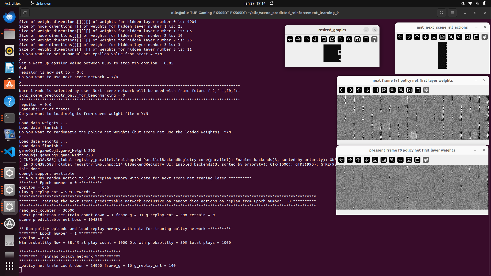
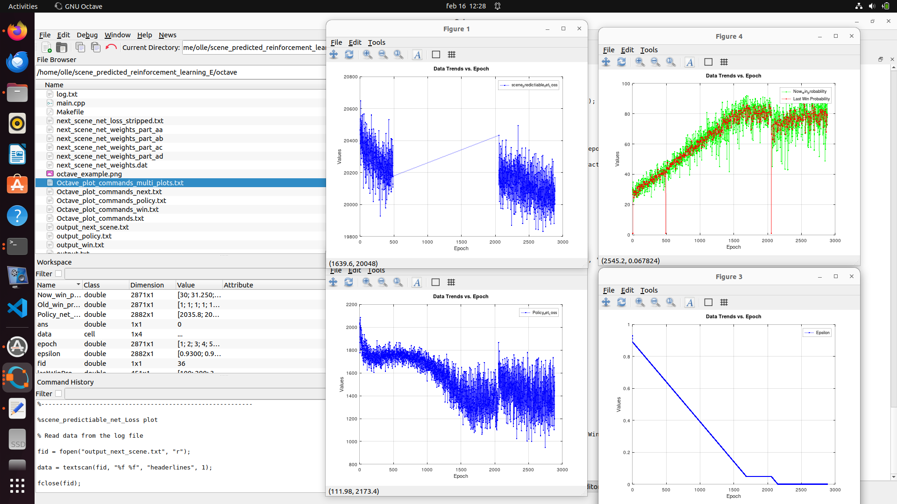

# Scene predicted reinforcement learning

## Predicetd next scene depending on 3 diffrent actions, Down, Up or Not move the pad

Dual reinforcemnt learning network.
1. This first network try to predict the next frame scene one step in future. This "next_scene_fc_net" network will produce one scene for each possible action at next future state.
2. The other network is then take the post frame f-2,f-1, present fram f0 and the next predicted frame f+1 to policy network "policy_fc_net" to control how the pad to the action.

Next scene network "next_scene_fc_net" is purely trained on random action to not learn any policy. Next scene net should only predict next frame not anything to do with rewards policy. 

The benefit to have this next scene network is that the policy net could test where the best action in future frames will be.
For example if the agent have 3 action to select then the policy network check 3 diffrent scene in future and then in this 3 diffrent scene the policy then check each of this next scene will 
get strongest (best) action. So now with next scene network the algorithm search 2 step in future search tree. So instead of 3 possible action to select the policy check 3*3 = 9 different action values.

This approch of dual network will have a larger future search tree in future.

### To evaluate benchmark this network
To evaluate benchmark if this is a good strategy I have make a switch in the program called 

    skip_scene_predicotr_only_for_benchmarking = 0;
    frame to policy network = 
    f-2,f-1,f0,f+1
    
set this to 1

    skip_scene_predicotr_only_for_benchmarking = 1;
    frame to policy network = 
    f-3,f-2,f-1,f0

Then we skip use "next_scene_fc_net" network 
and instead put in only post f-3,f-2,f-1,f0 frame and presenet frame into policy network f-3,f-2,f-1,f0 

## Combine (or split) large data files in ubuntu

### Combine to a next_scene_net_weights.dat file

        cat next_scene_net_weights_part_* > next_scene_net_weights.dat

### Split next_scene_net_weights.dat file
        split -b 8M next_scene_net_weights.dat next_scene_net_weights_part_

## Octave plot example

        

